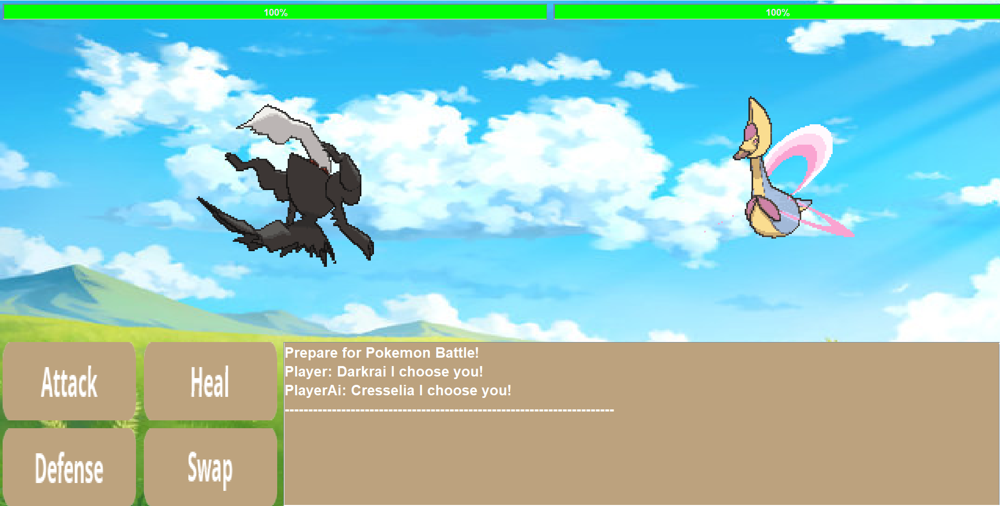

# Pokémon Battle Simulator 
This Pokémon Battle Simulator allows players to engage in exciting turn-based battles using various Pokémon. The simulator is designed to provide a realistic and engaging Pokémon battle experience, complete with different moves, strategies, and outcomes.

In case you want to check out, here's link to our presentation slides: [Presentation](https://docs.google.com/presentation/d/18OZ4ov5St6cAIvWGQH5LLCylErJciXATBBqE7P2hu-o/edit?usp=sharing).

## Architecture 
This application adopts the [Clean Architecture](https://blog.cleancoder.com/uncle-bob/2012/08/13/the-clean-architecture.html) principles for a maintainable and scalable design. At its core are the business entities, surrounded by use cases that form the application's business rules. Interface adapters translate between these use cases and external components like databases and UIs. This layered approach ensures that changes in external frameworks have minimal impact on business logic, keeping the codebase robust and flexible.
 
The architecture is structured into layers, with the most central one being the Entities layer, which contains the business objects of the application. Surrounding this are the Use Cases, which encapsulate and implement all of the business rules for the application. External to the Use Cases is the Interface Adapters layer, which converts data from the format most convenient for the use cases and entities, to the format most convenient for some external agency such as the Database or the Web. Finally, at the outermost layer, we have the Frameworks and Drivers, which are generally composed of frameworks and tools such as the Database, the Web Framework, or other high-level tools.

Following these guidelines, our application ensures that the business rules are at the core of the system's design, thus protecting them from external changes and making the system robust and testable. More information about how we used clean architecture can be found [here](https://docs.google.com/presentation/d/1PDqGYWZ6Y_l8xoNbyR7SroA73VyJT5V9e_9OKkr4S9A/edit?usp=sharing.)   

## Gameplay Features
- Turn-based combat system that mimics the official Pokémon games
- A selection of Pokémon each with unique stats and moves
- Randomized AI opponent behavior for varied gameplay
- Graphical interface showcasing the battle progress
- Background music and sound effects for an immersive experience 


## Installation

To set up and run this Java project on your local machine, follow these steps:

1. **Clone the Repository**
    ```sh
    git clone https://github.com/YehyunLee/PokemonGame
    cd PokemonGame
    ```

2. **Check for Java Installation**
    Ensure you have Java installed on your system. You can check this by running:
    ```sh
    java -version
    ```
    If Java is not installed, download and install it from [Oracle's Java website](https://www.oracle.com/java/technologies/javase-jdk11-downloads.html).

3. **Run the Project**
 Run the **main.java** inside **src/main**

6. **Enjoy the Game**
    The game should now start. Follow the on-screen instructions to play.

Note: These steps assume you have Git and Java correctly installed and configured on your system.

7. **TA Instructions**
- For TA, please run the start test game, instead of start game.
- Test game will call new API to get the new data.
- Start game will use pre-loaded data saved as pickle file. We ran for 3 hours to save 100~1000 pokemon data.
- If you search "// [DEVELOPMENT] Limit number of Pokemons" you can modify to set the limit of creating pokemons.
- This is set to 100. Max is 1000.
- If you are using Mac, start game may not work, in this case, use test game. Our one of group member had problem
  running start game on Mac. We are not sure why, but test game works fine on Mac. Start game work perfectly on Windows.

8. **Justification for the Clean Architecture Design / Unit Testing Files**
-  GameView has only 1 violation of importing entity.Pokemon. This is because we are sticking UI componenet with
    entity.Pokemon. We are not creating new pokemon entity, instead, use case create pokemon entity and pass it to UI.
    We are only using the returned pokemon entity from use case, and use for loop to display the pokemon in our UI.
    We are using import statement to avoid PyCharm error message, since for loop require to specify the type of the
    variable.
- Our TestGameView is not fully obeying CA rules since this is only for TA to call start test game. We are not using
    this class for our game. Thus, we didn't pay too much attention to follow CA rules on this. It's meant to be added
    only for TA to test our game. We won't provide further update on this class.
- For other unit testing files, Alex was responsible for creating them. However, we had trouble with communicating with
    him. We tried to contact him multiple times, but he didn't respond. Due to lack of time, we did our best job to
    create unit testing files.
- Since this is interactive video game, we decided not to use presenter, controllers. BattleView act as view model 
    where it gets input and output and update UI directly. For presenter, controller, we decided to not use it since
    it's not necessary for this project. When user push attack, it calls corresponding use case and update UI directly.4
    Our gateways are directly coded with interface under subfolders. Again, this was justified in presentation slides.

9. **Outdated Progress Update**
- Please refer to git commit history for the latest progress update.
______________________________________________________________________________________________________
[Updates]
October 30, 2023 [Yehyun]
Last week, we changed our project domain from AITextEditor to PokemonGame. You can still find our old project blueprint and API explorer activity in our AITextEditor branch. We received feedback from TA and devised a plan for entity, UML diagram, and sequence diagram.
[Yehyun] Worked on setting entity and use case folder, setting basics entities file, and mainly implemented Pokemon entity.
[Muaj] Working on PlayerPokemons entity
[Alex] Worked on Move entity. Leave it as a class for now, may be implemented as an interface/factory.


Oct, 2023
Tyseer changed the project to the Maven project
Nov 7, 2023 [Yehyun]
Download sprites and organize it, removing unnecessary sprites
Nov 8, 2023 [Yehyun]
Worked on getCombinedListOfPokemonSprites -> RENAMED to PokemonListFromSpritesDataAcessObject
Tyseer made interface to my code and added documents (comments on each methods) and removed unnecessary code.
Nov 9, 23 [Yehyun]
Our old code was very inefficent when it comes to creating dozens of Pokemons. It will fetch the sprites directory for every Pokemon.
I made some improvement and made this more efficient.
4 BIG UPDATES:
1. Improved speed (efficiency)
2. Creating all pokemon names (Converting ID to names)
3. Creating all Pokemon classes
4. User chooses 6 from all Pokemon lists (images to be added later)
   Noc 10~21 [Yehyun]
   There were many changes that’s not mentioned during this interval:
   I worked on GameState now called InitilizeGameState and CreatePlayers and general implementation of running game. We now implemented RunGame where it player go back and forth and takes moves.
   API has 50 call per 10 min limit. Thus, we are calling 1000 calls for 3~4H and save it to pickle. Worked on code for loading pickles as well. This also fixed the bug that involved not able to creating all pokemon object due to using name not IDs

[Logic of Program: Basic Structure of Program]
Hey everyone, Yehyun here. I am writing down these logics so that everyone can catch up with important files. Please feel free to update this section.

1. PokemonFactoryFromData
   This creates a Pokemon
- calls PokemonApiCallParser to set Pokemon attributes
- calls PokemonListFromSpritesDataParser to set sprites
______________________________________________________________________________________________________


Special Thanks to Tyseer and Muaj for their hard work on this project! — from Yehyun
