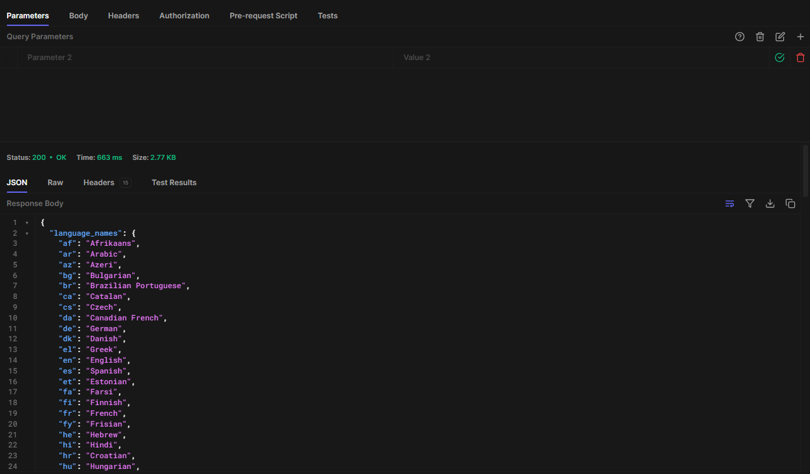
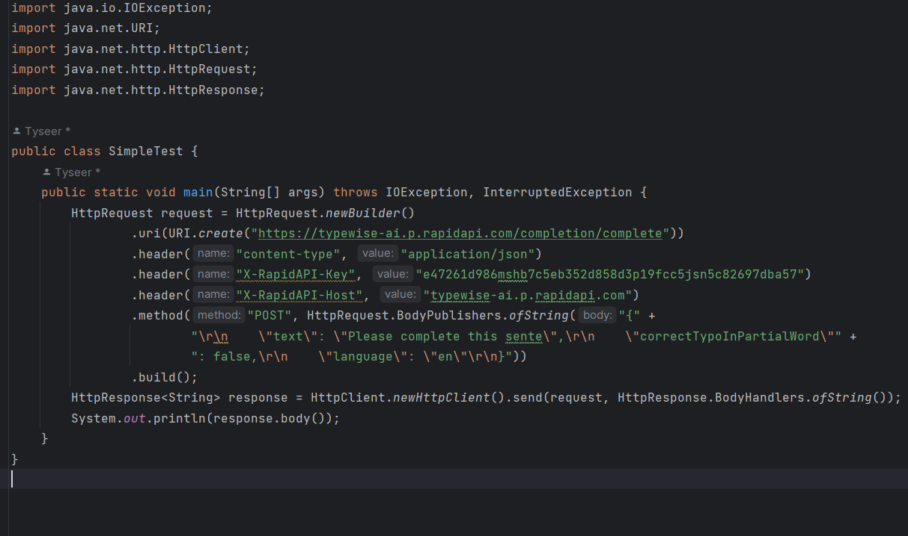
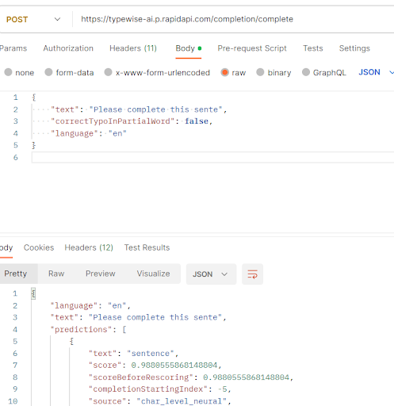
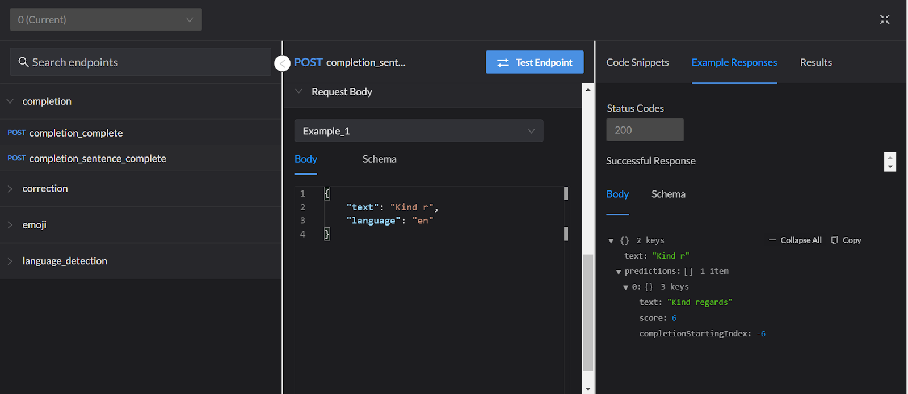

**Activity: Exploring APIs**

_________________________________________________________________________

**[Project Domain]**

AI Text Editor: Autocomplete, spelling, punctuation, grammar check, rephrasing sentences, and more!

**[Description]**

Our team is planning to develop a text editor integrated with the power of AI. We are planning to implement features like autocomplete, spelling, punctuation, grammar check, and rephrasing sentences.

The main purpose is to make further improvements from existing text editors like Google document, and Microsoft Word, where we want to leverage the power of AI.

We will first use a local database either CSV file or MySQL to store the user’s data, but if given time at the end of a project, we plan to use a cloud-based database. This text editor is targeted at one user, so we plan to not integrate authentication.

We will use **Typewise AI** to implement the autocomplete feature. This is a free API, with unlimited request limits, with very fast speed. For spelling, punctuation, grammar check, and rephrasing features, we found difficulty finding an API that is completely free, has unlimited request limits, and is fast. Thus, we plan to use scraping to use website platforms to implement those features. Additionally, we plan to use **Microsoft Text Analytics** to analyze sentiment. For simple features like word count, and readability, we will use Java to locally calculate and analyze the texts.

If given time, we would like to go further and implement features like a plagiarism checker and AI detection. However, we will focus on important features first.

We will use the [Hemingway App](https://hemingwayapp.com/), a text analyzer, to refer to the GUI design. We currently do not have specific plans on whether to use **Swing** or just use pure Java vanilla GUI. We will first experiment, and then decide.

Regarding **Typewise AI**, the advantage comes from very fast speed and free with unlimited request limits. Features it has are “completion complete”, “completion sentence complete”, “correction final word”, “correction whole sentence”, “emoji search”, and “language detection”.

We’re still deciding how we will use autocomplete. There are many different ways. We are trying to come up with the best GUI for a user. First, the use of the autocomplete function is when a user is typing on a text editor, automatically, we will run the API to get the predicted next word like Github Copilot. The second use case is when the user presses TAB, we will list the next word prediction in the order of prediction scroll.

We will automatically save the texts on the local database frequently so that the user can reopen the text editor to continue working on it.

A formal document of Typewise AI is here: [Typewise API](https://api.typewise.ai/v0/docs)

The link to the testing of Typewise AI can be found here at Rapid API: [Typewise AI API Documentation (lucacampanella1-PZRRXHotl8e) | RapidAPI](https://rapidapi.com/lucacampanella1-PZRRXHotl8e/api/typewise-ai).

Following is a research we’ve conducted for various APIs, we explored.

Our Java code experiment can be found at the very end of the document.

_________________________________________________________________________

[**Research**]

Muaj

~~https://rapidapi.com/plagspotter/api/duplicate-content-checking/~~

~~https://rapidapi.com/PerfectTenseAPI/api/perfect-tense/~~

----------------------------------------

Martin

~~https://rapidapi.com/microsoft-azure-org-microsoft-cognitive-services/api/microsoft-text-analytics1/~~

----------------------------------------

Tyseer

----------------------------------------

Alex

~~https://rapidapi.com/kdictionaries/api/lexicala1/pricing~~

----------------------------------------

Yehyun

~~https://prowritingaid.com/~~

~~https://rapidapi.com/grammarbot/api/grammarbot-neural/~~

~~https://rapidapi.com/lucacampanella1-PZRRXHotl8e/api/typewise-ai~~

~~Check everything & Find better ones~~

----------------------------------------

Total 6 APIs by Friday night, 8 PM

<table>
  <tr>
   <td>Name of API
   </td>
   <td><del>PlagSpotter</del>
   </td>
  </tr>
  <tr>
   <td>Feature
   </td>
   <td>Check URLs or offline text for originality or duplicate content that is posted on the web.
   </td>
  </tr>
  <tr>
   <td>Price
   </td>
   <td>Prices not listed. Free version isn’t what we’re looking for. Actual price needs to be negotiated with the people in charge.
   </td>
  </tr>
  <tr>
   <td>Daily Limits
   </td>
   <td>Depends solely on what option you buy. One option requires paying for each api call.
   </td>
  </tr>
  <tr>
   <td>Comments (Opinion)
   </td>
   <td>Don’t recommend this. Process of getting access to the API will take time and cost money. As per the website: “We can manually setup your free API account. You will be provided with a username and password as well as the API client file. Testing the API is free with our sample text but any other text/URLs won’t be checked without the money in your account. After you deposit the money in your account to buy API calls, you can start using the API to check any text/URLs you’d like.”
   </td>
  </tr>
  <tr>
   <td>Image of Output (Optional)
   </td>
   <td>
   </td>
  </tr>
</table>

<table>
  <tr>
   <td>Name of API
   </td>
   <td><del>Perfect Tense</del>
   </td>
  </tr>
  <tr>
   <td>Feature
   </td>
   <td>The Perfect Tense API is an artificial intelligence powered spelling and grammar API. All you have to do is provide a piece of text and the Perfect Tense API will automatically return a proofread version of the text, along with all spelling and grammar mistakes.
   </td>
  </tr>
  <tr>
   <td>Price
   </td>
   <td>1000 instances per month for free, 10,000 instances per month for a monthly payment of $99 or custom planning

14 trial for free
   </td>
  </tr>
  <tr>
   <td>Daily Limits
   </td>
   <td>1000 instances per month for free. An instance is any time a text area is loaded with Perfect Tense enabled.
   </td>
  </tr>
  <tr>
   <td>Comments (Opinion)
   </td>
   <td>When making an account in an attempt to get access to the API, it asks to input the domain where we will use Perfect Tense. I believe we can’t make a website for our project and are limited to making a GUI in Java, hence we won’t be able to use this API.  
   </td>
  </tr>
  <tr>
   <td>Image of Output (Optional)
   </td>
   <td>
   </td>
  </tr>
</table>

<table>
  <tr>
   <td>Name of API
   </td>
   <td>Microsoft Text Analytics
   </td>
  </tr>
  <tr>
   <td>Feature
   </td>
   <td>Entity linking

<strong>Document summarization</strong>

<strong>Conversation summarization</strong>

<strong>Key phrase extraction</strong>

<strong>Language detection</strong>

Named Entity Recognition (NER)

Customer content detection

<strong>Sentiment analysis and opinion mining</strong>

Text Analytics for health

Personal Identifiable information (PII)
   </td>
  </tr>
  <tr>
   <td>Price
   </td>
   <td>Free
   </td>
  </tr>
  <tr>
   <td>Monthly Limit
   </td>
   <td>5,000 text records per MONTH (1 text record = 1,000 characters)

125,000 characters across all submitted documents (asynchronous) otherwise 5,120 (synchronous)

Documents per Request:

Conversation summarization: 1

Language Detection: 1000

Sentiment Analysis: 10

Opinion Mining: 10

Key Phrase Extraction: 10

Named Entity Recognition (NER): 5

Personally Identifying Information (PII) detection: 5

Document summarization: 25

Entity Linking: 5

Text Analytics for health: 25 for the web-based API, 1000 for the container. (125,000 characters in total)
   </td>
  </tr>
  <tr>
   <td>Comments (Opinion)
   </td>
   <td>A lot of features are available, but the limit could be a limiting factor.
   </td>
  </tr>
  <tr>
   <td>Image of Output (Optional)
   </td>
   <td>
   </td>
  </tr>
</table>

<table>
  <tr>
   <td>Name of API
   </td>
   <td><del>Lexicala</del>
   </td>
  </tr>
  <tr>
   <td>Feature
   </td>
   <td>Lexicala API is a REST interface offering access to dictionary and lexical data from our monolingual, bilingual, multilingual and learner’s dictionaries in JSON format.

Through the API, developers can access complete dictionary entries, including translations in all available languages, rather than search by language pair. The API allows flexible search by grammatical information, or access to full dictionary entries including extensive syntactic and semantic details in 50 European and Asian languages.

Seamlessly integrate our data in your dictionary and language learning apps, games and word puzzles. 

Make use of our numerous language pairs for translation, localization or lemmatization for your app or service. 

Our dictionary data is useful for AI training, NLP applications, or linguistic research and development.
   </td>
  </tr>
  <tr>
   <td>Price
   </td>
   <td>Basic:

Free

Pro:

$100/mo
   </td>
  </tr>
  <tr>
   <td>Daily Limits
   </td>
   <td>Basic:

100/day

10 request/sec

Pro:

100,000/mo + $0.001 each other

10 request/sec
   </td>
  </tr>
  <tr>
   <td>Comments (Opinion)
   </td>
   <td>Limit is quite not enough for a text edit app, as I think it requires a lot of calls to the API. 
   </td>
  </tr>
  <tr>
   <td>Image of Output (Optional)
   </td>
   <td>

   </td>
  </tr>
</table>

<table>
  <tr>
   <td>Name of API
   </td>
   <td><del>ProWritingAid</del>
   </td>
  </tr>
  <tr>
   <td>Feature
   </td>
   <td>Grammar, Spelling, Punctuation, Rephrases
   </td>
  </tr>
  <tr>
   <td>Price
   </td>
   <td>Free for first 500 calls
   </td>
  </tr>
  <tr>
   <td>Daily Limits
   </td>
   <td>500 word count limit

10 rephrases per day

Grammar, Spelling, Punctuation

Word explorer & Thesaurus

Document type setting

100% Data security and privacy
   </td>
  </tr>
  <tr>
   <td>Comments (Opinion)
   </td>
   <td>Free plan, with daily limit, instead of monthly limit. Which is great!

Grammar, spelling, punctuation features may be free without limits. I will try and see the outcome.

Contacted to gain access to API
   </td>
  </tr>
  <tr>
   <td>Image of Output (Optional)
   </td>
   <td>
   </td>
  </tr>
</table>

<table>
  <tr>
   <td>Name of API
   </td>
   <td><del>GrammarBot Neural</del>
   </td>
  </tr>
  <tr>
   <td>Feature
   </td>
   <td>Spelling and grammar corrections in JSON format
   </td>
  </tr>
  <tr>
   <td>Price
   </td>
   <td>0/month; Freemium
   </td>
  </tr>
  <tr>
   <td>Daily Limits
   </td>
   <td>15,000 / day

Hard Limit

3,000 / month

+ US$0.00002 each other
   </td>
  </tr>
  <tr>
   <td>Comments (Opinion)
   </td>
   <td>Freemium plan. Small request limites. Hard to use this one.
   </td>
  </tr>
  <tr>
   <td>Image of Output (Optional)
   </td>
   <td>
   </td>
  </tr>
</table>

<table>
  <tr>
   <td>Name of API
   </td>
   <td>Typewise AI
   </td>
  </tr>
  <tr>
   <td>Feature
   </td>
   <td>Autocomplete
   </td>
  </tr>
  <tr>
   <td>Price
   </td>
   <td>Free, unlimited request limits
   </td>
  </tr>
  <tr>
   <td>Monthly Limit
   </td>
   <td>0
   </td>
  </tr>
  <tr>
   <td>Comments (Opinion)
   </td>
   <td>Different autocomplete features. Fast, free, unlimited limits.
   </td>
  </tr>
  <tr>
   <td>Image of Output (Optional)
   </td>
   <td>
   </td>
  </tr>
</table>

_________________________________________________________________________

**[Java Code Sample Results]**

**[Explanation]**

Following code is example when we used the completion_complete call.

We wrote down the sentence “Please complete this sente”. Then the API outputs the list of words in the order of a prediction score that’s based on AI. For example, in this case, “sentence” is the first one listed, with a score of 98.8%. Typewise API has different features like completing the whole sentence as well. These features will be valuable for the completion of our project.

**[Difficulties]**

Some of the difficulties were not the technology, but finding the right API. It appears that many APIs are freemium, paid, or in most cases free trials. Also, speed was a major concern as well. However, after long hours of research, we were able to find good APIs and found a good website that we could use by scraping.

**[Screenshot of using toosl to test API (postman and rapidapi.com)]**

